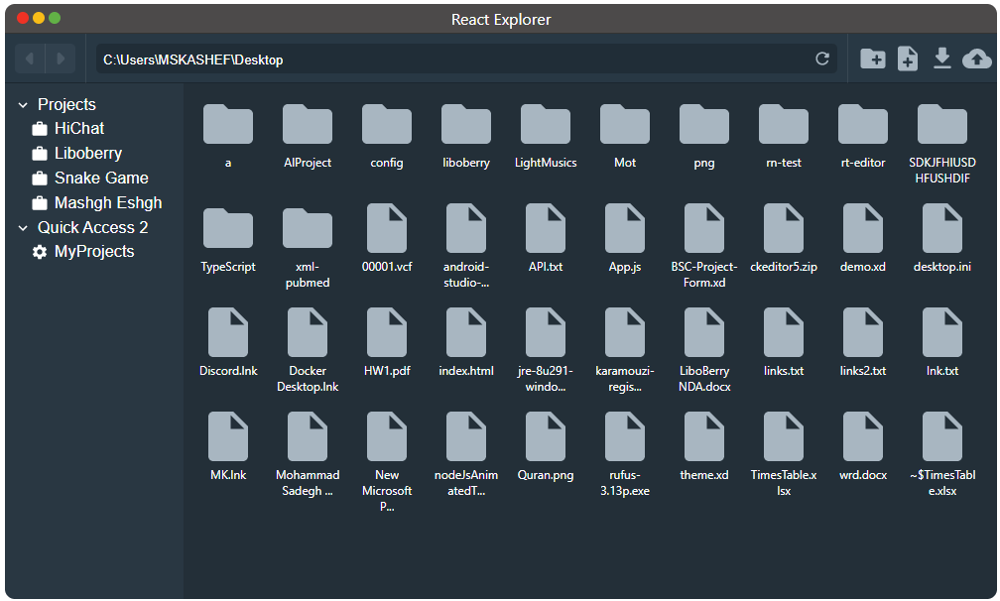

# React File Explorer

This is a File Explorer component for react.

## Screenshot


## Simple Usage
```JavaScript
<ReactExplorer
    defaultDir={'C:\\Users\\MSKASHEF\\Desktop'}
    request={getDir}
    enableShortcuts={true}
    onFileOpen={handleFileOpen}
    shortcuts={[...]}
    onWindowRedButtonPressed={handleRedButtonPressed}
    onWindowYellowButtonPressed={handleYellowButtonPressed}
    onWindowGreenButtonPressed={handleGreenButtonPressed}
    toolbar={[...]}
    enableSideBar={true}
/>
```

## Theme Customization
To customize the colors, just apply a `theme` property to the component:
```JavaScript
<ReactExplorer
    theme={{
        headerBackgroundColor: '#4C4A4A',
        windowRedButtonColor: '#EF3224',
        windowYellowButtonColor: '#F9BD18',
        windowGreenButtonColor: '#62B146',
        windowTitleColor: '#FFFFFF',
        toolbarBackgroundColor: '#283844',
        toolbarDividerColor: '#FFFFFF14',
        sidebarBackgroundColor: '#293742',
        mainBackgroundColor: '#232F38',
        addressBarBackgroundColor: '#00000030',
        sidebarTextColor: '#FFFFFF',
        mainTextColor: '#FFFFFF',
        toolbarTextColor: '#FFFFFF',
        headerTextColor: '#FFFFFF',
        refreshIconColor: '#A8B6C1',
        addressBarTextColor: '#FFFFFF',
        dividerColor: '#00000050',
        itemColor: '#A8B6C1',
        itemTextColor: '#FFFFFF',
        selectedItemBorderColor: '#A8B6C1',
        selectedItemBackgroundColor: '#FFFFFF22',
        navigationIconColor: '#A8B6C1',
        navigationButtonColor: '#31414E',
        toolbarIconColor: '#A8B6C1',
        loadingColor: '#FFFFFF'
    }}
    ...
/>
```
## Starting the project
To start this project, you should have `npm` pre-installed on your sysem.
Then in the project directory do:
- run `npm install` to install the project dependencies.
- run `npm start` to start the project on your localhost with port `3000` (`http://localhost:3000`)
